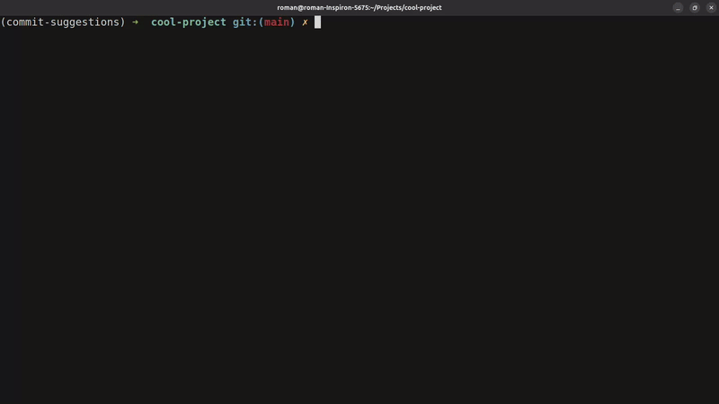

# 📌 Commit Suggestions

Commit Suggestions is a tool that will recommend commit messages based on changes to your codebase!

If you're anything like me, you forget to make good commit messages which is always a pain when you inevitably go back through the git log! Well, not anymore!



## 🚀 Features

- ✨ **AI-powered** commit message generation based on code changes
- 🛠 **Parses Git Diff** output feed into prompt generator
- 🔥 **Saves time** by eliminating the need to manually craft messages


---

## 📥 Installation

### **Prerequisites**
- **[Python 3.8+](https://www.python.org/downloads/)** installed
- Ensure you have **[Dependency 1](https://example.com)** and **[Dependency 2](https://example.com)** installed.
- Ensure you have **[uv](https://docs.astral.sh/uv/getting-started/installation/)** installed for managing and synching the python package.
- Ensure your **[OpenAI env variable](https://platform.openai.com/docs/libraries)** is set:
```{bash}
export OPENAI_API_KEY="your-secret-key"
```


### **Setup**
```bash
# Clone the repository
git clone https://github.com/ROMANT21/commit-suggestions
cd commit-suggestions

# Install dependencies and create python virtual environment (venv)
uv sync

# Activate venv (for linux)
source .venv/bin/activate

# Run the program
commit-suggestions
```
## 🤝 Contributing

Want to improve Commit Suggestions? Contributions are welcome!

1. Fork this repository
2. Create a new branch (git checkout -b feature-branch)
3. Commit your changes (git commit -m "Add feature X")
4. Push to your fork (git push origin feature-branch)
5. Submit a Pull Request


## 🐛 Issues & Feedback

Found a bug? Have a suggestion? Open an (issue)[https://github.com/ROMANT21/commit-suggestions/issues].


## 📜 License

This project is licensed under the MIT License. See LICENSE for details.

## ⭐ Show Your Support

If you find Commit Suggestions helpful, please star ⭐ this repository and share it with others!
